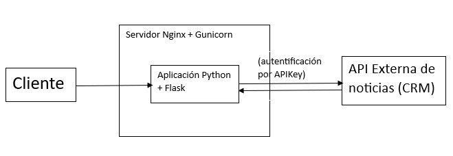

Este proyecto consiste en una aplicación Flask desplegada en DigitalOcean. Proporciona endpoints para verificar el estado de la aplicación y consultar datos de un CRM externo. 

# Documentacion de repositorio

## Pasos para levantar/desplegar
1. Clonar el repositorio en el droplet:
```
git clone https://github.com/MichaelBraMer/python-test-lexy.git
cd python-test-lexy
```
2. Instalar las dependencias:
```
pip3 install -r requirements.txt
```
3. Levantar el servidor con gunicorn:
```
gunicorn --bind 0.0.0.0:8000 run:app
```
(levantamiento en local)
``` 
python run.py
```

## Endpoints Disponibles
### GET /status

* Descripción: Devuelve el estado del servidor.
* Curl:
```
curl --location 'http://localhost:8000/status'
```
* Respuesta: {
    "message": "App is running",
    "status": "OK"
}

### GET /leads

* Descripción: Consulta datos de "leads" desde el CRM (servicio externo simulado, en este caso se uso una api de noticias para el ejemplo).
* Autenticación: Internamente la app rescata una api key desde la variable de entorno CRM_API_KEY para realizar la petición al servicio externo.
* Curl:
```
curl --location 'http://localhost:8000/leads'
```
* Ejemplo de Respuesta:
```
{
    "articles": [
        {
            "author": "mkalioby",
            "content": "Leopards is a way to query list of dictionaries or objects as if you are filtering in DBMS.\r\nYou can get dicts/objects that are matched by OR, AND or NOT or all of them.\r\nAs you can see in the compar… [+5424 chars]",
            "description": "Query your python lists. Contribute to mkalioby/leopards development by creating an account on GitHub.",
            "publishedAt": "2024-11-15T06:18:48Z",
            "source": {
                "id": null,
                "name": "Github.com"
            },
            "title": "Query Your Python Lists",
            "url": "https://github.com/mkalioby/leopards",
            "urlToImage": "https://opengraph.githubassets.com/882787b6acd7ecb66810e60ff7fc2fb640128058f0d215831fc00234cfac9734/mkalioby/leopards"
        },
    ],
    "status": "ok",
    "totalResults": 5755
}
```
# Documentacion para levantar en DigitalOcean
## Instrucciones para Replicar la Infraestructura
1. Crear Droplet en DigitalOcean
    1. Inicia sesión en DigitalOcean.
    2. Crea un droplet con Ubuntu 22.04.
    3. Configura un tamaño adecuado (mínimo 1GB de RAM).
2. Configurar el Entorno
    1. Actualizar el droplet:
    ```
    sudo apt update && sudo apt upgrade -y
    ```
    2. Instalar Python y dependencias:
    ```
    sudo apt install python3 python3-pip -y
    sudo pip3 install flask gunicorn
    ```
    3. Configurar Firewall:
    ```
    sudo ufw allow OpenSSH
    sudo ufw allow 80
    sudo ufw enable
    ```
    4. Configurar variables de entorno: Crea un archivo .env para almacenar datos sensibles:
    ```
    CRM_API_KEY=api_key
    CRM_API_URL=https://crm_url.com
    ```
3. Ve a ([pasos para desplegar](#pasos-para-desplegar) y sigue los pasos)
3. Configurar gunicorn y Nginx
    1. Prueba el servidor con gunicorn:
        ```
        gunicorn --bind 0.0.0.0:8000 run:app
        ```
    2. Configurar Nginx:
        1. Crea un archivo de configuración para Nginx:
        ```
        sudo nano /etc/nginx/sites-available/python-test-lexy
        ```
        2. Escribe esto:
        ```
        server {
            listen 80;
            server_name tu_dominio_o_ip;

            location / {
                proxy_pass http://127.0.0.1:8000;
                proxy_set_header Host $host;
                proxy_set_header X-Real-IP $remote_addr;
            }
        }
        ```
        3. Habilita la configuración:
        ```
        sudo ln -s /etc/nginx/sites-available/python-test-lexy /etc/nginx/sites-enabled
        sudo systemctl restart nginx
        ```
# Endpoints de servidor en DigitalOcean
* status: http://159.223.104.183/status/
* leads: http://159.223.104.183/leads/

# Decisiones de Diseño

* Infraestructura Modular: Se utiliza una estructura de carpetas en Flask para separar controladores, servicios y utilidades, para garantizar la mantenibilidad.
* Seguridad: Variables de entorno que protegen las claves API.
* Escalabilidad: Uso de gunicorn y Nginx permite manejar múltiples conexiones en producción.

# Adicional tarea de automatización
* La app realizará un log cada vez que se realice una petición a [leads](https://github.com/MichaelBraMer/python-test-lexy/blob/main/app/utils/log_leads.py) 